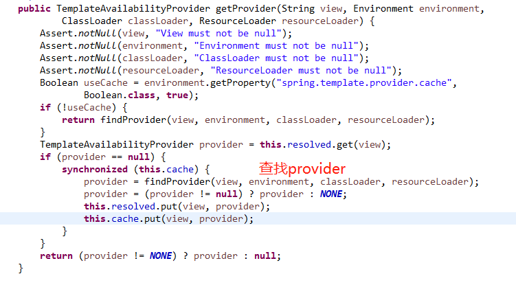

# Spring Boot 2.x Whitelabel Error Page 源码分析以及解决方案


在使用 `Spring Boot` 如果出现错误会出现 `Whitelabel Error Page` 页面，这个是 `Spring Boot` 默认处理错误的一个页面，是一硬编码的形式创建的。我们可以替换调，使用自己的error页面，并且美化它。

网上也有很多类似的文章，不过看了很多有的不全面、有的根本就是错误的(比如设置`server.error.whitelabel.enabled=false`添加`error.html`，这是有前提的)， 今天我们从源码的角度来分析它并给出解决方案。

首选`Spring Boot` 如果出现错误，比如：`500`、`503`、`404`等，均是有   `org.springframework.boot.autoconfigure.web.servlet.error.BasicErrorController` 处理的，我们也可以重写它（如果你重写了它，你会惊奇的发现：下面的内容是多余的，哈哈）实现自己的逻辑;


从图上可以看出 `Spring Boot` 想的很周全，同步和异步均有处理，这里我们只讨论同步的问题, 因为只有同步会出现`Whitelabel Error Page`

我们定位到解析视图的那句代码
```java
ModelAndView modelAndView = resolveErrorView(request, response, status, model);
```

`resolveErrorView` 是由父类`AbstractErrorControllers`实现  


`ErrorViewResolver` 的默认实现是  `DefaultErrorViewResolver`  


从`resolve`方法中我们可以拆分一下几步
1、找到可用的模版引擎提供者
> 假如出现的错误是 `500` 则此时`errorViewName="error/500" ` 

 - 查找逻辑交给了`TemplateAvailabilityProviders`类的`getProvider`方法，此方法会缓存已经存在的模板引擎提供者, 具体由`findProvider`去查找，若`findProvider`也没找到会默认注册一个`NoTemplateAvailabilityProvider`



- 注意 `this.providers` 这是 `Spring Boot` 在容器启动的时候就会添加的，通过模板引擎类名是否存在来判断是否添加某个的模板引擎提供者，默认`Spring Boot` 会注册一下几个模板引擎提供者；


- 加载模板引擎提供者

> `loadFactories` 加载的是`spring-boot-autoconfigure-2.xxxx.jar`下面的`META-INF/spring.factories`, 此方法可以获取父类所有的实现类 


- 这里以`ThymeleafTemplateAvailabilityProvider`为例

从图中可以看出找的是`classpath:/templates/error/500.html`
所以若出现`500`错误我们可以在`src/main/resources/` 下新建目录`templates/error`在新建一个`thymeleaf`的`500.html`模板就可以了；`404`错误同理

- 从这里我们不难看出若想成功找到错误模板必须满足一下条件
> 1. 类路径存在模板引擎的`jar`
> 2. `classpath`下存在存在当前错误模板`(例:500.html)`

2、若第1步中的`provider`找到则不用继续下一步，直接返回找到的视图

3、若第1步中没有满足条件的`provider`则交给`resolveResource`处理；我们来看看`resolveResource`的逻辑

这一步主要的直接获取静态的`html`；一般`500`和`404`可以直接使用静态的`HTML`资源展示一个友好的提示即可，所以这里直接获取静态的资源文件
默认查找位置如下

> 可以通过配置改变

假如出现的错误是`500`，查找结果如图;我们只需要创建资源文件，就可以访问`<staticLocations>/error/5xx.html`


4、如果以上三步都没满足，怎么办？从`BasicErrorController` 中可以看到最后会有个`error`默认view，就会去找`classpath:/templates/error.html`,处理逻辑同上；如果依然找不到`Spring Boot` 就会默认交给 `ErrorMvcAutoConfiguration`中的 `StaticView` 去渲染
> 前提是 `server.error.whitelabel.enabled=true`
```java
private static class StaticView implements View {

    private static final Log logger = LogFactory.getLog(StaticView.class);

    @Override
    public void render(Map<String, ?> model, HttpServletRequest request,
            HttpServletResponse response) throws Exception {
        if (response.isCommitted()) {
            String message = getMessage(model);
            logger.error(message);
            return;
        }
        StringBuilder builder = new StringBuilder();
        Date timestamp = (Date) model.get("timestamp");
        Object message = model.get("message");
        Object trace = model.get("trace");
        if (response.getContentType() == null) {
            response.setContentType(getContentType());
        }
        builder.append("<html><body><h1>Whitelabel Error Page</h1>").append(
                "<p>This application has no explicit mapping for /error, so you are seeing this as a fallback.</p>")
                .append("<div id='created'>").append(timestamp).append("</div>")
                .append("<div>There was an unexpected error (type=")
                .append(htmlEscape(model.get("error"))).append(", status=")
                .append(htmlEscape(model.get("status"))).append(").</div>");
        if (message != null) {
            builder.append("<div>").append(htmlEscape(message)).append("</div>");
        }
        if (trace != null) {
            builder.append("<div style='white-space:pre-wrap;'>")
                    .append(htmlEscape(trace)).append("</div>");
        }
        builder.append("</body></html>");
        response.getWriter().append(builder.toString());
    }

    private String htmlEscape(Object input) {
        return (input != null) ? HtmlUtils.htmlEscape(input.toString()) : null;
    }

    private String getMessage(Map<String, ?> model) {
        Object path = model.get("path");
        String message = "Cannot render error page for request [" + path + "]";
        if (model.get("message") != null) {
            message += " and exception [" + model.get("message") + "]";
        }
        message += " as the response has already been committed.";
        message += " As a result, the response may have the wrong status code.";
        return message;
    }

    @Override
    public String getContentType() {
        return "text/html";
    }

}
```

这就是 `Whitelabel Error Page` 来源

综上所述，共有如下解决方案
> 若项目中使用了模板引擎 比如`thymeleaf` `freemarker`  
> 此时`server.error.whitelabel.enabled`关闭和开启无关
1. 在`classpath`下新建模板 `/templates/error/5xx.html` `/templates/error/4xx.html`
2. 在`classpath`下新建静态资源 `/<staticlocation>/error/5xx.html` `/<staticlocation>/error/4xx.html`
3. 在`classpath`下直接新建模板 `/templates/error.html`

> 若项目中没有任何模板引擎
1. 设置`server.error.whitelabel.enabled=true`使用内置`view`渲染，出现`Whitelabel Error Page`
2. 若`server.error.whitelabel.enabled=false`将不会有任何信息


若以上有不懂或错误，可以留言
码专不易，转载注明出处

关注WX公众号,精彩不容错过


