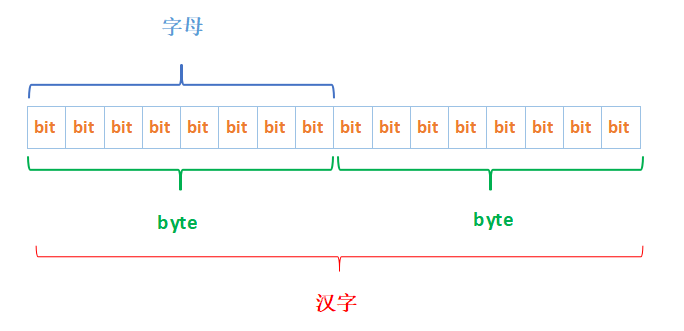

# <center>二进制及位运算的理解</center>
## bit 、byte 、字

> `1 bit` = `1`  二进制数据 计算机中最小的单位  
> `1 byte` = `8 bit`  
> `1 字母` = `1 byte` = `8 bit`  
> `1 汉字` = `2 byte` = `16 bit`
> `1 KB` = `1024 byte`  
> `1 MB` = `1024 KB`  
> `1 GB` = `1024 MB`  

## 基础知识 原码、补码、反码
1. 原码  
一个正数，按照绝对值大小转换成的二进制数；一个负数按照绝对值大小转换成的二进制数，然后最高位补1，称为原码。  
***示例：***  
`5` 的原码 `00000000 00000000 00000000 00000101`  
`-5` 的原码 `10000000 00000000 00000000 00000101`  
> 比如byte类型,用2^8来表示无符号整数的话,是0 - 255了；如果有符号， 最高位表示符号,0为正,1为负,那么,正常的理解就是 -127 至 +127 了.这就是原码了,值得一提的是,原码的弱点,有2个0,即+0和-0（10000000和00000000）；还有就是,进行异号相加或同号相减时,比较笨蛋,先要判断2个数的绝对值大小,然后进行加减操作,最后运算结果的符号还要与大的符号相同；于是,反码产生了
2. 反码  
正数的反码与原码相同，负数的反码为对该数的原码除符号位外每一位位取反  
*取反的概念 原为1 得0 原为0 得1*  
***示例：***  
正数：  
`5` 的原码 `00000000 00000000 00000000 00000101`  
`5` 的反码 `00000000 00000000 00000000 00000101`  
`-5` 的原码 `10000000 00000000 00000000 00000101`  
`-5` 的反码 `11111111 11111111 11111111 11111010`

3. 补码  
正数的补码与原码相同，负数的补码为对该数的原码除符号位外各位取反，然后在最后一位加1  
***示例：***  
`5` 的原码 `00000000 00000000 00000000 00000101`  
`5` 的反码 `00000000 00000000 00000000 00000101`   
`5` 的补码 `00000000 00000000 00000000 00000101`  
`-5` 的原码 `10000000 00000000 00000000 00000101`  
`-5` 的反码 `11111111 11111111 11111111 11111010`  
`-5` 的补码 `11111111 11111111 11111111 11111011`  

## 位运算符
|符号|描述|规则|
|----|----|----|
|&|与|两个都为1，结果才是1|
|\||或|两个都为0，结果才是0|
|^|与或|两个位相同时为0，不同时为1|
|~|取反|0变1，1变0|
|<<|左移|各个二进制位左移若干位，高位丢弃，低位补0|
|>>|右移|各个二进制位右移若干位；对无符号数，高位补0；有符号数，各编译器处理方法不一样，有的补符号位(算术右移)，有的补 0 (逻辑右移)；`java中二进制码整体右移，左边的用原有标志位补充，右边超出的部分舍弃`|
|>>>|无符号右移|`（Java和C、C++）运算符` 不管正负标志位为0还是1，将该数的二进制码整体右移，左边部分总是以0填充，右边部分舍弃|

## 位运算常用技巧
### 1. 判断奇偶性
> 根据最末位是0还是1判断 ; 0 就是偶数， 1就是基数  
> 使用 `a & 1 == 0` 替换 `a % 2 == 0`  

### 2. 交换两个数
假设a = 10; b =12 交换两个变量的值  
原始操作
```java
int a = 10, 
b = 12 ,
c = a;
a = b;
b = c;
```
位运算
```java
int a = 10,
b = 12;
a ^= b;
b ^= a;
a ^= b;
```
> 解释：  
> 第一步 a ^= b 即 a = a^b ; a = 1010 ^ 1100 = 0110 = 6  
> 第二步 b ^= a 即 b = b^a ; b = 1100 ^ 0110 = 1010 = 10  
> 第三步 a ^= b 即 a = a^b ; a = 0110 ^ 1010 = 1100 = 12  

