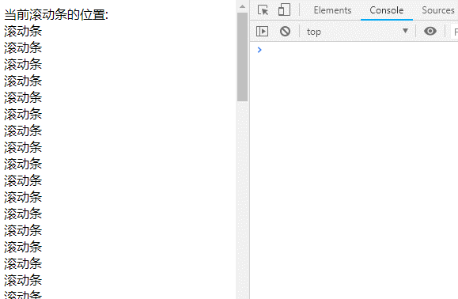

# 函数节流与函数防抖
## 一、 函数防抖 `(debounce)`  
**概念**  
> 在事件被触发 `n` 秒后在执行某个操作, 如果在这 `n` 秒内再次被触发, 则重新计算时间；即多次动作只执行最后一次

**1、举例：** 如果有人进入电梯(事件被触发)， 电梯将在10秒后出发，这时候又有人进入电梯(过了5秒，即10秒内再次触发该事件)，则电梯要重新等待10秒（重新计时，此时总共需要等待15秒）

**2、实现**  
```javascript
function debounce(fn, delay){
    // [delay]秒之后执行异步，若[delay]秒内多次触发重新计时
    return function(){
        var _this = this
        fn.timer && clearTimeout(fn.timer)
        
        fn.timer = setTimeout(()=>{
            fn.apply(_this, arguments)
        }, delay)
    }
}

// 实际执行的函数 模拟获取输入框的值异步校验
function ajax(value, isDebounce){
    console.log('异步验证唯一性 ', value, isDebounce? '防抖操作':'非防抖操作')
}

window.onload=function(){
    var account1 = document.querySelector('.account1')
    var account2 = document.querySelector('.account2')

    account1.addEventListener('keyup', function(e){
        // 实时异步请求
        ajax(e.target.value, false)
    })
    account2.addEventListener('keyup', function(e){
        // 防抖异步请求
        debounce(ajax, 1000)(e.target.value, true)
    })
}


```  

***函数抖动效果如图***    
  

注意：~~**错误的防抖函数**~~  
```javascript
function debounce(fn, delay){
    var timer = null
    return function(){
        var _this = this
        timer && clearTimeout(timer)
        
        timer = setTimeout(()=>{
            fn.apply(_this, arguments)
        }, delay)
    }
}
```

## 二、函数节流 `(throttle)`  
**概念**  
> 规定在一个单位时间内，只能触发一次动作；如果在这个单位时间内触发了多次动作，则只有一次生效；即在单位时间内限制执行的频率

**实现**
```javascript

/**
 * fn 实际执行的动作
 * delay 延迟的时间(秒)
 */
function throttle(fn, delay){
    var lastime = fn.lastime, timer = fn.timer
    return function(){
        var now = +new Date(),  _this = this,  args = arguments
        if(lastime && lastime < now + delay * 1000 ){
            !timer && (fn.timer = setTimeout(()=>{
                clearTimeout(timer)
                fn.lastime = now
                fn.timer = null
                fn.apply(_this, args)
            }, delay))
        }else{
            clearTimeout(timer)
            fn.lastime = now
            fn.apply(_this, args)
        }
    }
}
// 实际执行的函数 获取当前滚动条的位置
function currentPos(){
    var pos = document.documentElement.scrollTop || document.body.scrollTop
    console.log('当前位置', pos)
    document.querySelector('#postion').innerHTML = pos
}
window.onload=function(){

    window.addEventListener('scroll', function(){
        throttle(currentPos, 500)()
    })
}
```

***函数节流效果如图***   

节流图  
   

非节流图  
   

## 三、总结
- 函数防抖和函数节流都是防止某一时间频繁触发某个动作
- 函数防抖是某一段时间内只执行一次，而函数节流是间隔时间执行
- 函数节流适合大量事件按时间做平均分配触发
- 适合多次事件一次响应的情况

### 应用场景
1. 函数防抖  
>- 搜索输入框联想，用防抖可以减少请求次数  
>- 表单提交时候可以防止重复提交  
>- 使用 `keyup/keydown/input` 等事件，表单验证可以避免必要的验证  
>- `window.resize`的时候，用防抖只触发一次逻辑处理 

2. 函数节流
>- 监听滚动事件判断是否到页面底部自动加载更多  
>- 目标频繁多次触发，单位时间内只触发一次
>- `DOM` 元素的拖拽功能实现`（mousemove）`
>- 射击游戏的 `mousedown/keydown` 事件（单位时间只能发射一颗子弹）