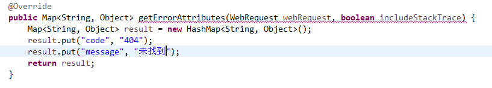
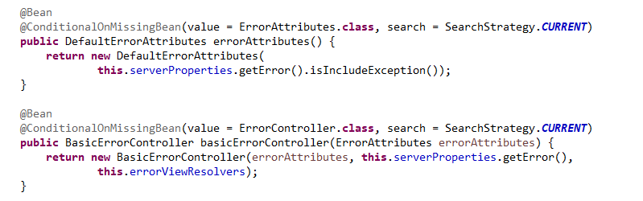
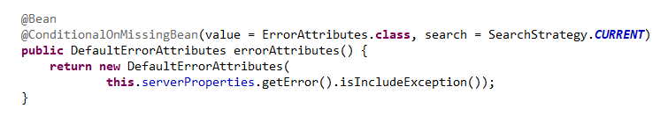

# 关于Spring Boot 2.x 自定义 ErrorAttributes 不起作用的问题解决

`Spring Boot` 的出现极大的简化了开发流程，封装了很多实用的工具；今天要说的是`2.x`版本中的异常处理，在`Spring Boot`中其实已经给我们实现好了异常处理方法；对应的`Controller`是`BasicErrorController` ，我们可以去实现它，改成自己的逻辑以及返回值，而且支持同步和异步。

通过解析源码我们知道，`BasicErrorController` 通过`ErrorAttributes`可以自定义返回属性，所以我们可以自定义一个`ErrorAttributes`类只要实现`ErrorAttributes`即可；默认`Spring Boot` 已经帮我们实现了一个`DefaultErrorAttributes`；如果我们想要改变其中属性我们只需要继承`DefaultErrorAttributes`即可，比如下面

不过这里有个小细节我们必须要注意`getErrorAttributes`第一个参数是`WebRequest`,为什么要说这个呢? 因为`Spring Boot 2.x` 还有一套`DefaultErrorAttributes`，名字长得一模一样，傻傻分不清；如果你发现自定义的`ErrorAttributes`无法起作用，可能就是包没引对。我们一起来看看

```java
org.springframework.boot.autoconfigure.web.servlet.error.ErrorMvcAutoConfiguration
```
自动注册了`MVC`的
```java
org.springframework.boot.web.servlet.error.DefaultErrorAttributes
```
如下


```java
org.springframework.boot.autoconfigure.web.reactive.error.ErrorWebFluxAutoConfiguration
```
也注册了一套`webflux`的
```java
org.springframework.boot.web.reactive.error.DefaultErrorAttributes
```


怎么样看清楚了吗，名字一模一样，包名不一样，功能也一模一样，
这里有个新概念`webflux`，不懂的同学自动跳转 [实战Spring Boot 2.0 Reactive编程系列 - WebFlux初体验](https://juejin.im/post/5b3a24386fb9a024ed75ab36)
默认情况`Spring Boot`走的的是`MVC`的，所以如果你继承的是`webflux`的`DefaultErrorAttributes`那就肯定不会起作用了，而且还有可能出现如下错误
```java
***************************
APPLICATION FAILED TO START
***************************

Description:

The bean 'errorAttributes', defined in class path resource [org/springframework/boot/autoconfigure/web/servlet/error/ErrorMvcAutoConfiguration.class], could not be registered. A bean with that name has already been defined in class path resource [com/micro/cfg/CfgErrorAttributes.class] and overriding is disabled.

Action:

Consider renaming one of the beans or enabling overriding by setting spring.main.allow-bean-definition-overriding=true


```

