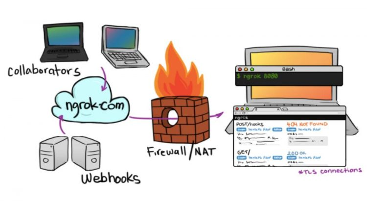
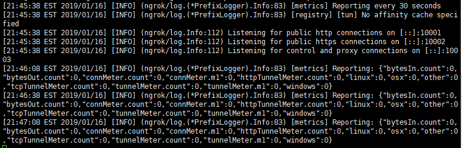

ngrok是一个反向代理工具，1.x版本源码开源；可以自己搭建一个服务来使用，将本地的web或tcp服务通过公共端口和外部建立一个安全通道，这样就可以通过外网直接访问本地对应的服务，在进行微信公众号等测试开发的时候非常有用

# 安装ngrok
## 环境
   `Linux Centos7` `git` `golang`  `openssl`
## 安装golang
1、下载golang
```bash
wget https://dl.google.com/go/go1.11.4.linux-amd64.tar.gz
```
> 默认在当前用户目录下  
> `cd ~`  
> `ls`

2、解压到`/usr/local`目录
> tar -C /usr/local -xzf go1.11.4.linux-amd64.tar.gz

3、添加环境变量
```bash
vim /etc/profile
```
在最后一行添加如下内容
```bash
export PATH=$PATH:/usr/local/go/bin
```
> `source /etc/profile` 使环境变量生效

## 安装ngrok
1、clone ngrok 到本地目录  `/usr/local/ngrok`
```bash
git clone https://github.com/inconshreveable/ngrok.git /usr/local/ngrok
```

2、配置
```bash
cd /usr/local/ngrok

# 临时设置域名 后面使用
export NGROK_DOMAIN="<youdomain>.com"

# 生产证书
openssl genrsa -out rootCA.key 2048
openssl req -x509 -new -nodes -key rootCA.key -subj "/CN=$NGROK_DOMAIN" -days 5000 -out rootCA.pem
openssl genrsa -out device.key 2048
openssl req -new -key device.key -subj "/CN=$NGROK_DOMAIN" -out device.csr
openssl x509 -req -in device.csr -CA rootCA.pem -CAkey rootCA.key -CAcreateserial -out device.crt -days 5000

# 将生成的证书替换ngrok默认的证书

# 先备份
cp assets/client/tls/ngrokroot.crt assets/client/tls/ngrokroot.crt.bak
cp assets/server/tls/snakeoil.crt assets/server/tls/snakeoil.crt.bak
cp assets/server/tls/snakeoil.key assets/server/tls/snakeoil.key.bak
# 替换
cp rootCA.pem assets/client/tls/ngrokroot.crt
cp device.crt assets/server/tls/snakeoil.crt
cp device.key assets/server/tls/snakeoil.key
```

3、编译不同平台的服务端和客户端
```bash
# 编译64位linux平台服务端
GOOS=linux GOARCH=amd64 make release-server
# 编译64位windows客户端
GOOS=windows GOARCH=amd64 make release-client
# 如果是mac系统，GOOS=darwin。如果是32位，GOARCH=386
```
> 注：  
>- Linux 平台 32 位系统：GOOS=linux GOARCH=386  
>- Linux 平台 64 位系统：GOOS=linux GOARCH=amd64  
>- Windows 平台 32 位系统：GOOS=windows GOARCH=386  
>- Windows 平台 64 位系统：GOOS=windows GOARCH=amd64  
>- MAC 平台 32 位系统：GOOS=darwin GOARCH=386  
>- MAC 平台 64 位系统：GOOS=darwin GOARCH=amd64  
>- ARM 平台：GOOS=linux GOARCH=arm  
>- 编译的是不带release的版本，还可以通过-tlsCrt和 -tlsKey选项来指定证书文件的位置  

执行后会在`bin`目录及其子目录下看到服务端`ngrokd`和`windows`客户端`windows_amd64/ngrok.exe`

4、启动服务端
```bash
./ngrokd  -domain="<youdomain>.com" -httpAddr=":10001"  -httpsAddr=":10002" -tunnelAddr=":10003"
```
>- 最后加 `&` 后台运行  
>- `-domain` 表示服务器域名  
>- `-httpAddr`表示默认监听的HTTP端口, 是访问普通的http使用的端口号，用后面用  `<subdomain>.<yourdomain>.com:10001` 来访问服务  
>- `-httpsAddr`表示默认监听的HTTPS端口,是访问https使用的端口号，用后面用 `<subdomain>.<yourdomain>.com:10002` 来访问服务  
>- `-tunnelAddr`表示服务器监听客户端连接的隧道端口号,这个端口是Ngrok用来通信的，所以这个端口在服务器上和客户端上设置必须要对应才可以正常的链接，默认不填写是4433  
>- `-log`表示日志文件位置  
>- `-log-level`用来控制日志记录的事件级别，选项有`DEBUG、INFO、WARNING、ERROR`  
>- 防火墙端口开放 `firewall-cmd firewall-cmd --permanent --zone=public --add-port=10001-10003/tcp`

出现以下消息说明启动成功  



## 附录1 参考文档
https://luozm.github.io/ngrok  
https://my.oschina.net/imjueying/blog/1786737  
http://ngrok.cn/docs.html  
http://www.imawen.com/content.html?id=26  

## 附录2 配置示例 YAML格式
```yaml
server_addr: <youdomain>.com:10003
trust_host_root_certs: false
log: ngrok.log
tunnels:
  test:
    addr: 10001
    proto: http
```

## 附录3 `windows` 启动示例
> 需要在命令`(cmd)`行下执行,不能是直接点击`.exe`文件运行
```cmd
ngrok.exe -subdomain=test -config="ngrok.yml" 8080
```
访问： `http://test.<youdomain>.com:10003`
> 一般 `80` 端口都是被使用了的，若也想让 `ngrok` 使用 `80` 端口，可以将客户端 `10001` 改成 `80` 再使用 `nginx` 作转发
